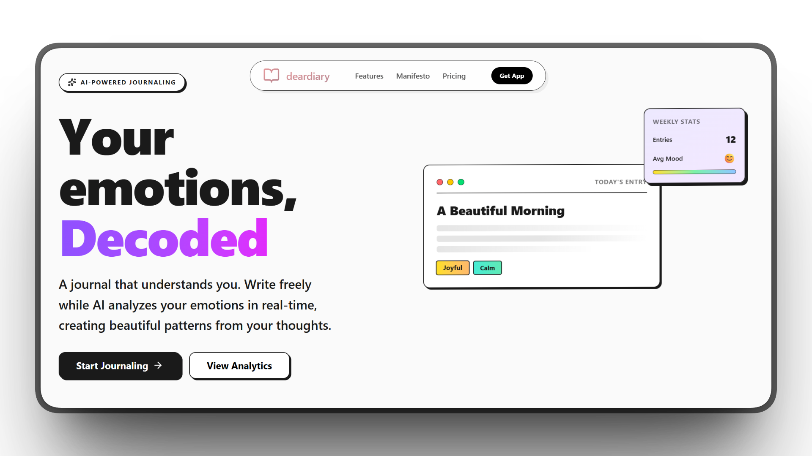
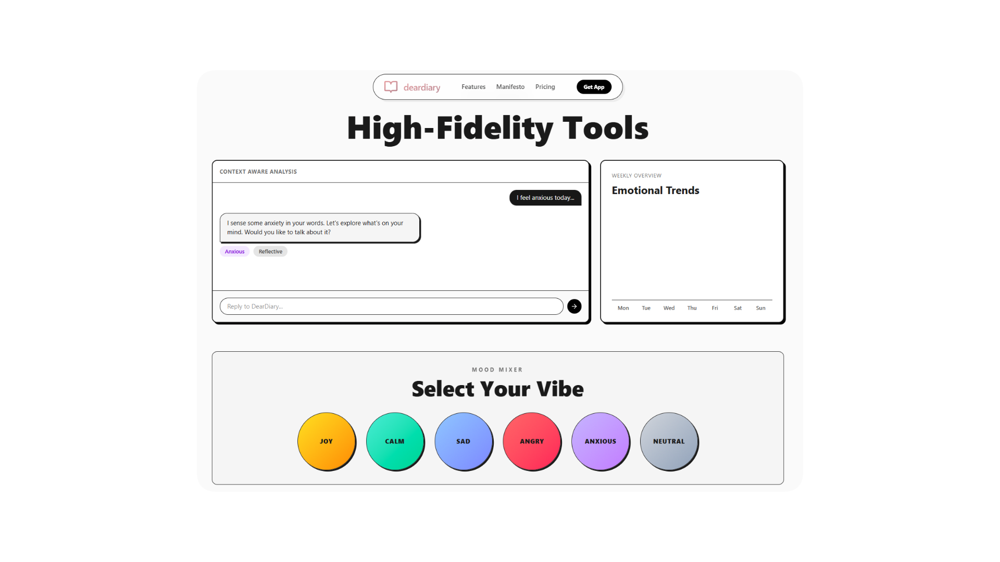
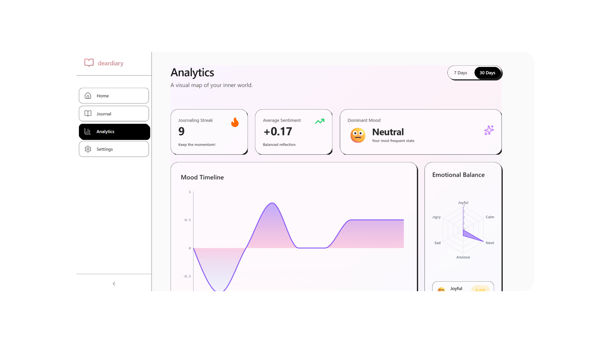
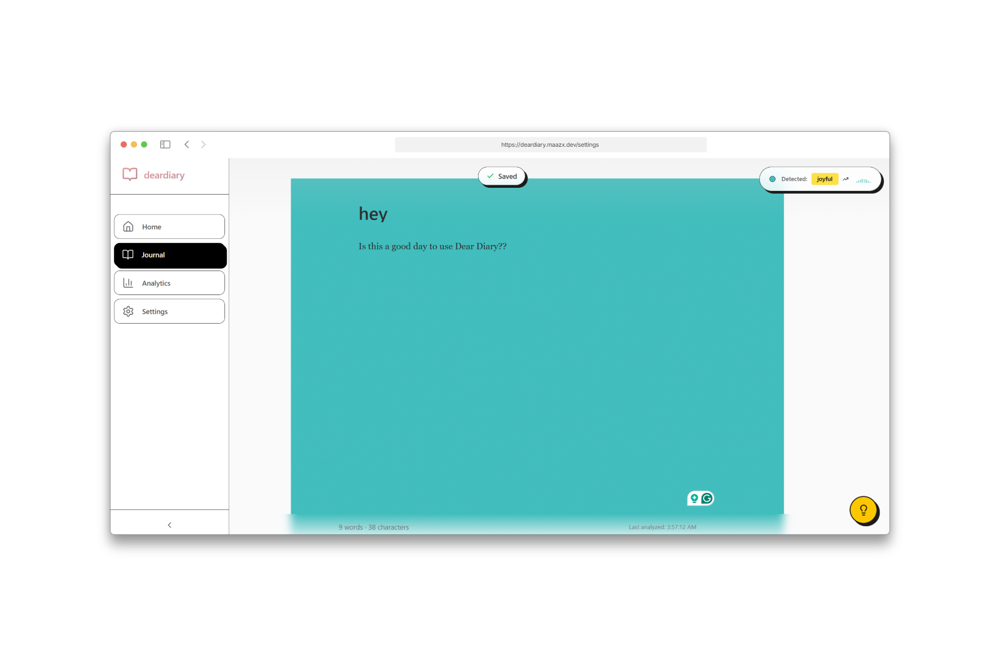

# DearDiary

Journaling app with real-time sentiment analysis and adaptive color UI.


[](https://deardiary.maazx.dev/)
[](https://nextjs.org/)
[](https://www.typescriptlang.org/)
[](https://tailwindcss.com/)

## Why I Built This

I've been journaling on and off for years, but I always struggled with consistency. The problem wasn't lack of motivation - it was that most journaling apps felt... lifeless. They were just blank pages that stared back at me. No personality, no feedback, nothing to make the experience feel alive.


One night after a particularly rough day, I was writing in my journal and noticed how my handwriting changed as my mood shifted. The letters got heavier when I was frustrated, lighter when I felt hopeful. It got me thinking - what if a digital journal could do something similar? What if it could respond to what I was feeling?

I wanted to build something that felt less like a tool and more like a companion. Something that could mirror back the emotions in my writing without being intrusive. So I spent a few nights experimenting with Groq's AI models and sentiment analysis. The first version was honestly terrible - colors flashing everywhere like a broken disco ball. But after a lot of tweaking (debouncing, color mapping, transition curves), it started to feel right.

The breakthrough came when I realized the app shouldn't just detect emotions - it should embody them. Gold for joy. Crimson for anger. Blue for sadness. Not as data points, but as atmosphere. The UI became this living thing that breathed with my thoughts. Writing angry? The whole screen turns red, and somehow that acknowledgment makes it easier to get the words out.
.png>)
I added the analytics dashboard later because I got curious about my own patterns. Apparently I'm way more anxious on Mondays than I thought. Seeing those mood trends laid out didn't just satisfy my curiosity - it actually motivated me to work on my mental health. Turns out having a visual history of your emotional state is pretty powerful.

The neobrutalism design came from a desire to make something bold and honest. No gradients hiding behind corporate polish. Just raw colors, thick borders, and interfaces that don't apologize for existing. It matches how journaling should feel - direct, unfiltered, real.

Some entries are two sentences. Some are essays. But every time, the colors shift and the app listens. If this helps even one other person feel less alone when they're writing, then the late nights were worth it.

## Features

- **Real-time Mood Detection**: Groq AI (Llama 3.3 70B) analyzes text and shifts background colors
- **Analytics Dashboard**: Track mood patterns and emotional trends over time
- **Local-First Storage**: Browser localStorage for privacy
- **Neobrutalism Design**: Bold borders, vibrant colors, high contrast

## Tech Stack

- **Next.js 15.1** - App Router with SSR
- **TypeScript 5** - Type-safe development
- **Tailwind CSS v4** - Utility-first styling
- **Groq SDK** - AI sentiment analysis
- **Sanity.io** - Headless CMS
- **Framer Motion** - Animations
- **Recharts** - Data visualization
- **shadcn/ui** - UI components

## Project Structure

```plaintext
dearDiary/
├── src/
│   ├── app/                    # Next.js App Router pages
│   │   ├── (dashboard)/        # Dashboard route group
│   │   │   ├── analytics/      # Mood analytics & charts
│   │   │   ├── dashboard/      # Main dashboard
│   │   │   ├── journal/        # Journal entry editor
│   │   │   └── settings/       # User preferences
│   │   └── api/                # API route handlers
│   │       ├── analytics/      # Analytics endpoints
│   │       ├── entries/        # CRUD operations
│   │       └── mood/           # Sentiment analysis
│   ├── components/
│   │   ├── analytics/          # Chart components
│   │   ├── editor/             # Journal editor & mood UI
│   │   ├── landing/            # Landing page sections
│   │   ├── navigation/         # Sidebar & nav
│   │   └── ui/                 # Reusable UI primitives
│   ├── lib/
│   │   ├── animations.ts       # Animation configurations
│   │   ├── groq-queries.ts     # Sanity query definitions
│   │   ├── mood-analyzer.ts    # Sentiment analysis logic
│   │   ├── sanity.ts           # Sanity client config
│   │   └── utils.ts            # Shared utilities
│   └── types/
│       └── index.ts            # TypeScript type definitions
├── sanity/                     # Sanity CMS configuration
│   ├── schemas/                # Content schemas
│   └── sanity.config.ts        # CMS setup
└── public/                     # Static assets
```

## Getting Started

### Installation

```bash
git clone https://github.com/somewherelostt/DearDiary.git
cd DearDiary
npm install
```

Create `.env.local`:

```env
GROQ_API_KEY=your_api_key
NEXT_PUBLIC_USE_GROQ=true
```

### Development

```bash
npm run dev
```

Open [http://localhost:3000](http://localhost:3000)

## Mood System

| Mood | Color | Range |
|------|-------|-------|
| 😊 Joyful | Gold | +0.6 to +1.0 |
| 😌 Calm | Sky Blue | +0.2 to +0.6 |
| 😐 Neutral | Gray | -0.2 to +0.2 |
| 😔 Sad | Blue | -0.6 to -0.2 |
| 😠 Angry | Crimson | -1.0 to -0.6 |
| 😰 Anxious | Orange | High volatility |

## License

MIT License - see [LICENSE](LICENSE)

---

**[Live Demo](https://deardiary.maazx.dev)** | **[GitHub](https://github.com/somewherelostt/DearDiary)**
